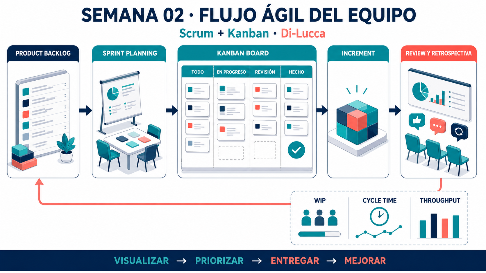

<!-- HU-STATUS TEMPLATE - do NOT remove the <!-- ... --> markers or the table headers.
     Your weekly grade is read AUTOMATICALLY from this file:
       02-week/hu-status/README.md  (inside YOUR fork). English. -->

# Weekly Status - Week 02

<!-- CONFIG-START - must match your profile repo (username/username) CONFIG -->
- FULL_NAME: Luis Ignacio Bonilla Delgado
- GITHUB_USER: LuisBonilla2260
- TEAM: Di-Lucca
- SPRINT_GOAL: Define the agile workflow practices that will guide planning, tracking, and delivery of the project.
<!-- CONFIG-END -->

## 1. User stories worked this week
| HU ID | Title | Status (todo/doing/done) | Evidence (PR or commit URL) |
|---|---|---|---|
| HU-002-001 | Define Kanban and Scrum practices for the project workflow | done | [Kanban-Scrum documentation commit](https://github.com/LuisBonilla2260/sistemas-distribuidos-2026-b-g2/commit/a16a28c6c631288dde36adf6b902ee4541ad9508) |

## 2. My individual contribution
- Documented the foundations, principles, roles, artifacts, events, and metrics of Scrum and Kanban.
- Defined a practical workflow that connects the product backlog, sprint planning, Kanban board, review, testing, and delivery.
- Identified WIP limits, flow metrics, explicit policies, blockers, dependencies, and Definition of Done as practices for the team.
- Documented recommendations for integrating Agile workflow practices with Git, pull requests, CI/CD, and continuous improvement.

## 3. Blockers and risks
- The team still needs to agree on the concrete board tool, WIP limits, and sprint cadence to apply in practice.
- Workflow policies must be kept aligned with the actual project process to avoid using the board only as a task list.
- Metrics should be used to improve delivery flow, not to evaluate individual performance.

## 4. Plan for next week
- Configure the project board with explicit workflow states and agreed WIP limits.
- Refine the initial backlog into prioritized, testable user stories with acceptance criteria.
- Define the first sprint goal, capacity, and Definition of Done with the team.
- Start tracking blockers and flow metrics during project execution.

## 5. Compliance self-check
- [ ] Conventional Commits - `type(scope): summary`
- [ ] Per-environment HU branch + PR to that environment (hu-xxx-dev -> develop, ...)
- [ ] Testable acceptance criteria
- [ ] Tests added/updated (unit / integration)
- [ ] DDD / hexagonal boundaries respected (domain has no I/O)
- [x] No secrets; config via environment variables

## 6. Evidence links
- [Kanban and Scrum practices document](KANBAN-SCRUM.md)
- [Kanban-Scrum documentation commit](https://github.com/LuisBonilla2260/sistemas-distribuidos-2026-b-g2/commit/a16a28c6c631288dde36adf6b902ee4541ad9508)

### Supporting visual

