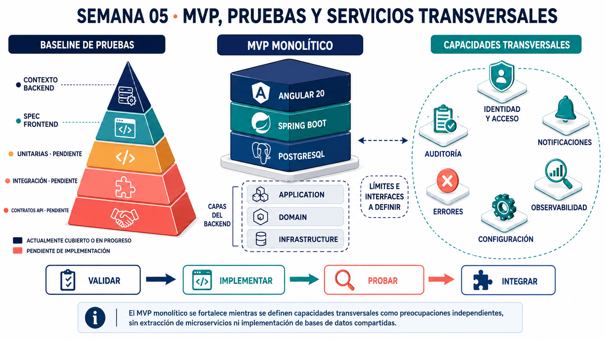

# Microservicios transversales: guía de apoyo

> Estado en la semana 05: este documento es material de estudio y una referencia para decisiones futuras. El MVP de Di-Lucca **no implementa microservicios transversales**; actualmente funciona como un monolito con Angular 20, Spring Boot y PostgreSQL.

## ¿Qué son?

Un microservicio transversal atiende una capacidad que puede ser requerida por varios dominios del sistema, sin convertirse en dueño de la lógica de negocio de cada uno. Su objetivo es proporcionar una interfaz clara y reutilizable, conservando la autonomía de los servicios de negocio.

Ejemplos frecuentes:

- Identidad y acceso: autenticación, autorización y gestión de roles.
- Notificaciones: envío de correo, SMS o mensajes internos a partir de solicitudes o eventos.
- Auditoría: registro de acciones relevantes para trazabilidad.
- Observabilidad: métricas, logs y trazas para operar el sistema.
- Configuración: parámetros por ambiente y secretos administrados de forma segura.
- Manejo de errores: convenciones de respuestas, códigos y registro técnico.

No todo código reutilizado debe convertirse en un microservicio. Una utilidad local o una librería compartida puede ser suficiente si no requiere despliegue, datos, escalado o ciclo de vida independiente.

## Relación con los dominios de Di-Lucca

Los dominios de negocio candidatos del sistema son Pacientes, Citas, Clínica y Facturación. Cada dominio debe conservar sus reglas y sus datos. Una capacidad transversal no debe sustituir esa propiedad.

```text
Pacientes ─┐
Citas ─────┼──► interfaz o evento explícito ──► capacidad transversal
Clínica ───┤                                  (por ejemplo, notificaciones)
Facturación┘
```

La comunicación debe producirse mediante contratos explícitos —API o eventos—, no por acceso directo a la base de datos de otro dominio.

## Riesgos que se deben evitar

- Crear una “base de datos compartida” para todos los servicios.
- Concentrar reglas de Pacientes, Citas o Facturación en un servicio transversal.
- Acoplar los dominios a una implementación concreta de correo, logs o autenticación.
- Extraer un servicio antes de conocer su propietario, contrato, datos y forma de operación.

## Criterio para una futura extracción

Antes de extraer una capacidad del monolito, el equipo debe poder responder:

1. ¿Qué necesidad atiende y quién es su dueño técnico?
2. ¿Qué contrato expone y qué dominios lo consumen?
3. ¿Qué datos posee y cuáles no debe leer directamente?
4. ¿Cómo se probará, observará, desplegará y recuperará ante fallos?
5. ¿Qué valor aporta extraerla frente a mantenerla dentro del MVP?

## Prioridad actual del MVP

En la semana 05 la prioridad es reforzar el monolito existente: preservar las capas `application`, `domain` e `infrastructure`, ampliar pruebas unitarias e integración, y validar los contratos API entre frontend y backend. La extracción de microservicios transversales solo debe evaluarse cuando exista una necesidad real y una frontera validada.


