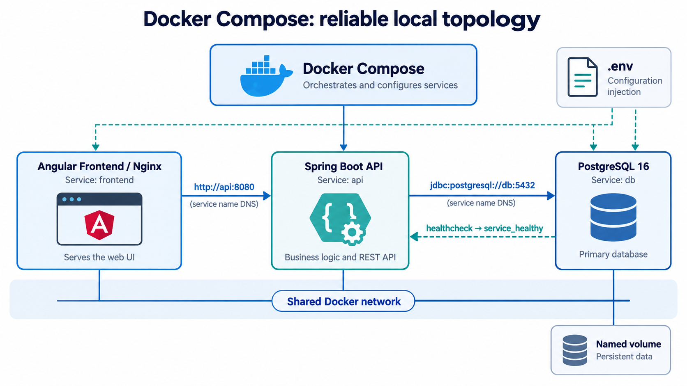

# Docker Compose orchestration support



## Purpose

This guide records the local orchestration baseline for the Di-Lucca MVP. It is a support artifact: service names, ports, and paths must be confirmed against the application repository before being applied. The objective is a repeatable `docker compose up` without embedding environment-specific configuration in images.

## Reference topology

| Concern | Recommended practice |
|---|---|
| Service discovery | Put services on the Compose network and call dependencies by service name, for example `http://api:8080` or `jdbc:postgresql://db:5432/app`. Do not use container IP addresses. |
| Persistent data | Mount PostgreSQL data on a named volume. Container filesystems are disposable. |
| Readiness | Define a database health check and gate dependent startup with `condition: service_healthy`. Each dependent service must still retry transient connections with bounded backoff. |
| Configuration | Read connection URLs, log levels, and credentials from the environment. Keep secrets out of Compose files committed to Git. |

## Readiness is not start order

`depends_on` by itself only controls start order. A database process can be started while it is still initializing. A reliable local topology therefore has two safeguards:

1. The database reports readiness through a health check.
2. The API waits for that health state and retries its initial dependency connection if the dependency is temporarily unavailable.

Reference fragment (adapt names and credentials to the actual application):

```yaml
services:
  api:
    depends_on:
      db:
        condition: service_healthy
    environment:
      DB_URL: ${DB_URL:?DB_URL is required}

  db:
    image: postgres:16
    healthcheck:
      test: ["CMD-SHELL", "pg_isready -U $${POSTGRES_USER}"]
      interval: 5s
      timeout: 3s
      retries: 12
    volumes:
      - dbdata:/var/lib/postgresql/data

volumes:
  dbdata:
```

## Verification checklist

- [ ] `docker compose config` resolves the Compose configuration without exposing a real secret.
- [ ] `docker compose up --build` starts all required services from a clean state.
- [ ] The database becomes healthy before the dependent API is considered ready.
- [ ] The API reaches the database through the service name, not `localhost` or an IP address.
- [ ] Stopping and recreating containers preserves database data through the named volume.
- [ ] A dependency restart is handled by the application retry policy or produces a clear, actionable error.

## Boundaries

Compose is appropriate for local development and a single-host deployment. Multi-host scheduling, rolling updates, autoscaling, and cluster self-healing are orchestrator concerns to evaluate only when the MVP needs them.
